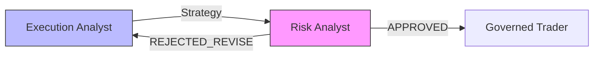

# Architecture: Hybrid LangGraph + Google ADK + Hybrid Inference + In-Process Governance

This document describes the hybrid architecture of the Cybernetic Governance Engine, which combines **LangGraph** for deterministic workflow orchestration with **Google ADK** for LLM-powered agent reasoning, supported by a **Hybrid Inference Stack** (vLLM + Vertex AI) and specialized **In-Process Governance**.

## Overview

```
┌─────────────────────────────────────────────────────────────────────────────┐
│                           CONTROL PLANE (Deterministic)                     │
│                                  LangGraph                                  │
│  ┌─────────────┐    ┌─────────────┐    ┌─────────────┐    ┌──────────────┐ │
│  │  Supervisor │───▶│ Conditional │───▶│    Risk     │───▶│  Refinement  │ │
│  │    Node     │    │   Routing   │    │   Router    │    │     Loop     │ │
│  └─────────────┘    └─────────────┘    └─────────────┘    └──────────────┘ │
├─────────────────────────────────────────────────────────────────────────────┤
│                                  ADAPTERS                                   │
│                        (Bridge: LangGraph ↔ ADK)                            │
├─────────────────────────────────────────────────────────────────────────────┤
│                          REASONING PLANE (Probabilistic)                    │
│                               Google ADK                                    │
│  ┌─────────────┐    ┌─────────────┐    ┌─────────────┐    ┌──────────────┐ │
│  │    Data     │    │  Execution  │    │    Risk     │    │   Governed   │ │
│  │   Analyst   │    │   Analyst   │    │   Analyst   │    │    Trader    │ │
│  └─────────────┘    └─────────────┘    └─────────────┘    └──────────────┘ │
└─────────────────────────────────────────────────────────────────────────────┘
```

## Why Hybrid?

| Concern | LangGraph | Google ADK |
|---------|-----------|------------|
| **Workflow Control** | ✅ Deterministic state machine | ❌ Probabilistic tool calls |
| **LLM Reasoning** | ❌ Manual prompt chaining | ✅ Native agent patterns |
| **Observability** | ✅ Explicit graph tracing | ✅ Built-in telemetry |
| **Checkpointing** | ✅ Redis/memory savers | ✅ Session service |

## In-Process Governance (The "Governance Sandwich")

We implement a strict separation of concerns to guarantee safety and structure without sacrificing reasoning depth.

### 1. The Brain (Reasoning)
*   **Model:** `gemini-2.5-pro` (Vertex AI).
*   **Role:** Complex analysis, document understanding, and "System 2" thinking.
*   **Safety:** Wrapped by NeMo Guardrails for semantic policy checks (e.g., preventing toxicity).

### 2. The Enforcer (Structure)
*   **Model:** `google/gemma-2-9b-it` (Self-Hosted on GKE with NVIDIA L4).
*   **Role:** Syntactic enforcement of JSON schemas via Finite State Machines (FSM).
*   **Technique:** We use vLLM's `guided_json` with **Prefix Caching** to achieve low-latency (<50ms) schema validation.
*   **Why:** A smaller, instruction-tuned model running locally is faster and more deterministic for formatting tasks than a large reasoning model.

This pattern ensures **Zero-Hallucination Structure** while leveraging **SOTA Reasoning Capabilities**.

---

## Observability & Tracing (Langfuse)

We use **[Langfuse](https://langfuse.com/)** (self-hosted in-cluster) as the centralized observability platform for the entire hybrid stack.

*   **Endpoint:** `http://langfuse-web.langfuse.svc.cluster.local:4317` (OTLP)
*   **Coverage:**
    1.  **LangGraph Control Plane:** Captures state transitions and routing decisions.
    2.  **Google ADK Agents:** Captures reasoning chains and tool invocations via OpenTelemetry instrumentation.
    3.  **vLLM (The Enforcer):** Captures token generation metrics (TTFT, ITL) and schema validation success/failure. We inject `OTEL_SERVICE_NAME=vllm-inference` to distinguish governance traces.

This unified view allows us to correlate "high-level intent" (Gemini) with "low-level enforcement" (vLLM) in a single trace.

---

## Component Breakdown

### 1. LangGraph Orchestration (`src/graph/`)

**Purpose**: Deterministic workflow control—no LLM decides the flow.

| File | Responsibility |
|------|----------------|
| `graph.py` | Defines the `StateGraph` with nodes, edges, and conditional routing |
| `state.py` | Typed state schema (`AgentState`) with message history and control signals |
| `router.py` | Helper functions for conditional edge logic |
| `checkpointer.py` | Redis-backed or in-memory persistence for conversation state |

**Key Pattern: Conditional Edges**
```python
workflow.add_conditional_edges("risk_analyst", risk_router, {
    "execution_analyst": "execution_analyst",  # Loop back if rejected
    "governed_trader": "governed_trader"       # Proceed if approved
})
```

### 2. Google ADK Agents (`src/agents/`)

**Purpose**: LLM-powered reasoning with Vertex AI/Gemini.

```
src/agents/
├── financial_advisor/
│   ├── agent.py            # Coordinator (Root Agent)
│   └── callbacks.py        # OTel Interceptor (ISO 42001)
├── data_analyst/agent.py   # Market research agent
├── execution_analyst/agent.py  # Strategy planning agent
├── risk_analyst/agent.py   # Risk evaluation agent
└── governed_trader/agent.py    # Trade execution with Propose-Verify pattern
```

Each agent is a `google.adk.agents.LlmAgent` with:
- Custom instructions
- Specialized tools
- Model configuration (Gemini via Vertex AI)

### 3. The Adapter Layer (`src/graph/nodes/adapters.py`)

**Purpose**: Bridge between LangGraph's sync node functions and ADK's async runners.

```python
def run_adk_agent(agent_instance, user_msg: str, session_id: str, user_id: str):
    """Execute an ADK agent and return results for LangGraph."""
    
    # 1. Ensure session exists
    asyncio.run(ensure_session())
    
    # 2. Create Runner
    runner = Runner(agent=agent_instance, session_service=session_service)
    
    # 3. Execute and collect events
    for event in runner.run(user_id, session_id, new_message):
        # Extract text and function calls
        ...
    
    return AgentResponse(answer=..., function_calls=...)
```

---

## The Supervisor Pattern

The Supervisor Node is the "brain" that:
1. **Runs the ADK root agent** to understand user intent
2. **Intercepts tool calls** (specifically `route_request`) to determine routing
3. **Returns a control signal** (`next_step`) that LangGraph uses for deterministic routing

```python
def supervisor_node(state):
    # 1. Run the coordinator agent
    response = run_adk_agent(root_agent, last_msg)

    # 2. Intercept routing tool call
    for call in response.function_calls:
        if call.name == "route_request":
            target = call.args.get("target")
            # Map to graph node
            if "data" in target.lower():
                next_step = "data_analyst"
            ...

    # 3. Return control signal for LangGraph
    return {"messages": [...], "next_step": next_step}
```

This pattern ensures:
- ✅ The LLM decides **intent** (what the user wants)
- ✅ The graph decides **execution** (how to fulfill it)

---

## Risk Refinement Loop

A key feature is the **self-correcting loop** between the Execution Analyst and Risk Analyst:



**How it works**:
1. Execution Analyst proposes a strategy
2. Risk Analyst evaluates (heuristic keyword detection: "high risk", "reject", etc.)
3. If rejected, LangGraph routes back to Execution Analyst with feedback injected
4. Loop continues until approved or escalated to human review

---

## Deployment Architecture

```
┌──────────────────────────────────────────────────────────────┐
│                     Cloud Run Service                         │
│  ┌─────────────────────┐    ┌────────────────────────────┐  │
│  │   Main Container    │    │    OPA Sidecar (Layer 2)   │  │
│  │   ───────────────   │    │    ────────────────────    │  │
│  │   FastAPI Server    │◀──▶│    Policy Enforcement      │  │
│  │   LangGraph         │    │    finance_policy.rego     │  │
│  │   ADK Agents        │    └────────────────────────────┘  │
│  │   NeMo Guardrails   │                                     │
│  └──────────┬──────────┘                                     │
│             │                                                 │
│             ▼                                                 │
│  ┌─────────────────────┐                                     │
│  │   Redis (State)     │                                     │
│  │   Cloud Memorystore │                                     │
│  └─────────────────────┘                                     │
└──────────────────────────────────────────────────────────────┘
```

**State Management (Dual Redis Strategy):**
1.  **Application State:** Uses **Google Cloud Memorystore** (External). Stores LangGraph conversation checkpoints (`AgentState`) and session history. Credentials injected via `REDIS_URL`.
2.  **Observability State:** Uses **Langfuse Internal Redis**. Deployed as a sidecar container within the Langfuse Helm chart on GKE. Used strictly for trace ingestion buffering and caching.

**Environment Variables**:
| Variable | Purpose |
|----------|---------|
| `GOOGLE_GENAI_USE_VERTEXAI=true` | Use Vertex AI instead of API key |
| `GOOGLE_CLOUD_PROJECT` | GCP project ID |
| `GOOGLE_CLOUD_LOCATION` | Region (e.g., `us-central1`) |
| `REDIS_URL` | Redis connection for state persistence |
| `MODEL_FAST` | Fast model alias (e.g., `gemini-2.5-flash-lite`) |
| `MODEL_REASONING` | Reasoning model alias (e.g., `gemini-2.5-pro`) |

---

## See Also

- [README_GOVERNANCE.md](README_GOVERNANCE.md) - Governance framework theory
- [STPA_ANALYSIS.md](STPA_ANALYSIS.md) - Safety analysis
- [deployment/README.md](deployment/README.md) - Deployment guide
