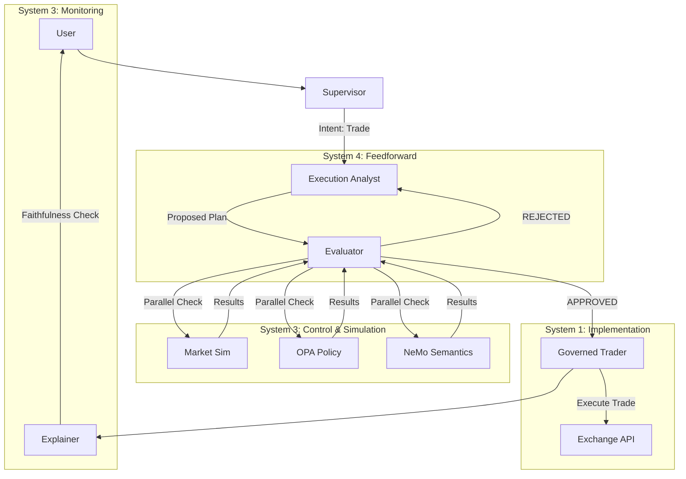

# Architecture: MACAW + Cybernetic Governance

This document describes the **Cybernetic Governance Architecture** of the Financial Advisor system, aligned with **ISO/IEC 42001** and Capital One's **MACAW** framework.

## 1. The Cybernetic Model (Viable System Model)

The system is designed not just as a software pipeline, but as a **Cybernetic Control System** that ensures safety through Feedback, Feedforward, and Requisite Variety.

| VSM System | Role | Component | Function |
| :--- | :--- | :--- | :--- |
| **System 5** | Identity / Policy | **Constitution** | Defines high-level goals ("Helpful & Harmless") and risk policies. |
| **System 4** | Intelligence / Feedforward | **Execution Analyst (Planner)** | Anticipates future states; generates plans; simulates outcomes (via Evaluator). |
| **System 3** | Control / Optimization | **Evaluator Agent** | The "Internal Regulator". Enforces constraints via simulation and policy checks. |
| **System 2** | Coordination | **Graph State & Schema** | Ensures data integrity and synchronization between agents (JSON Schemas). |
| **System 1** | Implementation | **Governed Trader (Executor)** | The "Dumb Executor". Performs the actual value-generating operations (Trades). |

---

## 2. The MACAW Sequential Architecture

We implement a strict **Sequential Blocking Architecture** for high-risk operations, prioritizing **Safety over Latency**.

### 2.1. Optimistic Planning, Pessimistic Execution

To balance User Experience (Latency) with Corporate Safety, we use a hybrid strategy:

1.  **Optimistic Speed (Internal):** The `Evaluator Node` runs its expensive checks (Market, OPA, NeMo) **in parallel** using `asyncio.gather`. This minimizes the wait time during the simulation phase.
2.  **Pessimistic Execution (Blocking):** The system **BLOCKS** the `Executor` until the Evaluator explicitly approves. There is no "Rollback" logic because financial trades are immutable. We verify *before* we act.

---

## 3. Governance Components

### 3.1. The Planner (Execution Analyst)
*   **Role:** Decomposes user intent into a DAG (Directed Acyclic Graph) of steps.
*   **Governance:** Fine-tuned on OpenAPI schemas to prevent "Tool Hallucination".

### 3.2. The Evaluator (The Critic)
*   **Role:** Simulates the plan against reality.
*   **Checks:**
    *   **Feasibility:** Is the market open? Do funds exist?
    *   **Regulatory:** Does this violate OPA policy?
    *   **Semantic:** Is this a jailbreak attempt (NeMo)?
*   **Cybernetics:** Provides the **Negative Feedback** loop to correct the Planner.

### 3.3. The Executor (Governed Trader)
*   **Role:** Pure implementation.
*   **Constraint:** "Dumb" agent. Cannot plan, cannot strategize. Only executes approved steps.

### 3.4. The Explainer
*   **Role:** Translates technical JSON into natural language.
*   **Governance:** Performs a **Faithfulness Check** (Self-Reflection) to ensure the explanation matches the execution logs, preventing "Post-Hoc Rationalization".

---

## 4. ISO 42001 Alignment

*   **Clause 6.1 (Actions to address risks):** The **Planner/Evaluator** loop functions as a dynamic Risk Assessment for every transaction.
*   **Clause 8.1 (Operational Planning):** The **Graph State** and **Evaluator Logic** constitute the operational controls.
*   **Clause 9.1 (Monitoring):** The **Explainer** and **Tracing (Langfuse)** provide real-time monitoring of agent performance.
