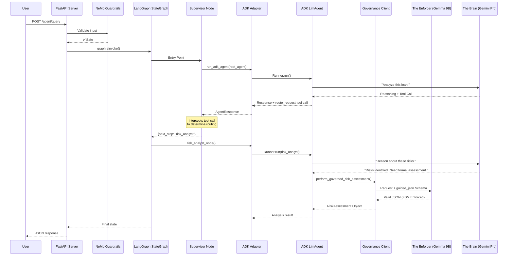

# Architecture: Hybrid LangGraph + Google ADK + Hybrid Inference + In-Process Governance

This document describes the hybrid architecture of the Cybernetic Governance Engine, which combines **LangGraph** for deterministic workflow orchestration with **Google ADK** for LLM-powered agent reasoning, supported by a **Hybrid Inference Stack** (vLLM + Vertex AI) and specialized **In-Process Governance**.

## Overview

```
┌─────────────────────────────────────────────────────────────────────────────┐
│                           CONTROL PLANE (Deterministic)                     │
│                                  LangGraph                                  │
│  ┌─────────────┐    ┌─────────────┐    ┌─────────────┐    ┌──────────────┐ │
│  │  Supervisor │───▶│ Conditional │───▶│    Risk     │───▶│  Refinement  │ │
│  │    Node     │    │   Routing   │    │   Router    │    │     Loop     │ │
│  └─────────────┘    └─────────────┘    └─────────────┘    └──────────────┘ │
├─────────────────────────────────────────────────────────────────────────────┤
│                                  ADAPTERS                                   │
│                        (Bridge: LangGraph ↔ ADK)                            │
├─────────────────────────────────────────────────────────────────────────────┤
│                          REASONING PLANE (Probabilistic)                    │
│                               Google ADK                                    │
│  ┌─────────────┐    ┌─────────────┐    ┌─────────────┐    ┌──────────────┐ │
│  │    Data     │    │  Execution  │    │    Risk     │    │   Governed   │ │
│  │   Analyst   │    │   Analyst   │    │   Analyst   │    │    Trader    │ │
│  └─────────────┘    └─────────────┘    └─────────────┘    └──────────────┘ │
└─────────────────────────────────────────────────────────────────────────────┘
```

## Why Hybrid?

| Concern | LangGraph | Google ADK |
|---------|-----------|------------|
| **Workflow Control** | ✅ Deterministic state machine | ❌ Probabilistic tool calls |
| **LLM Reasoning** | ❌ Manual prompt chaining | ✅ Native agent patterns |
| **Observability** | ✅ Explicit graph tracing | ✅ Built-in telemetry |
| **Checkpointing** | ✅ Redis/memory savers | ✅ Session service |

## In-Process Governance (The "Governance Sandwich")

We implement a strict separation of concerns to guarantee safety and structure without sacrificing reasoning depth.

### 1. The Brain (Reasoning)
*   **Model:** `gemini-2.5-pro` (Vertex AI).
*   **Role:** Complex analysis, document understanding, and "System 2" thinking.
*   **Safety:** Wrapped by NeMo Guardrails for semantic policy checks (e.g., preventing toxicity).

### 2. The Enforcer (Structure)
*   **Model:** `google/gemma-2-9b-it` (Self-Hosted on GKE with NVIDIA L4).
*   **Role:** Syntactic enforcement of JSON schemas via Finite State Machines (FSM).
*   **Technique:** We use vLLM's `guided_json` with **Prefix Caching** to achieve low-latency (<50ms) schema validation.
*   **Why:** A smaller, instruction-tuned model running locally is faster and more deterministic for formatting tasks than a large reasoning model.

This pattern ensures **Zero-Hallucination Structure** while leveraging **SOTA Reasoning Capabilities**.

---

## Request Flow



---

## Deployment Architecture

```
┌──────────────────────────────────────────────────────────────┐
│                     Cloud Run Service                         │
│  ┌─────────────────────┐    ┌────────────────────────────┐  │
│  │   Main Container    │    │    OPA Sidecar (Layer 2)   │  │
│  │   ───────────────   │    │    ────────────────────    │  │
│  │   FastAPI Server    │◀──▶│    Policy Enforcement      │  │
│  │   LangGraph         │    │    finance_policy.rego     │  │
│  │   ADK Agents        │    └────────────────────────────┘  │
│  │   NeMo Guardrails   │                                     │
│  └──────────┬──────────┘                                     │
│             │                                                 │
│             ▼                                                 │
│  ┌─────────────────────┐                                     │
│  │   Redis (State)     │                                     │
│  │   Cloud Memorystore │                                     │
│  └─────────────────────┘                                     │
└──────────────────────────────────────────────────────────────┘
```

**Environment Variables**:
| Variable | Purpose |
|----------|---------|
| `GOOGLE_GENAI_USE_VERTEXAI=true` | Use Vertex AI instead of API key |
| `GOOGLE_CLOUD_PROJECT` | GCP project ID |
| `GOOGLE_CLOUD_LOCATION` | Region (e.g., `us-central1`) |
| `REDIS_URL` | Redis connection for state persistence |
| `MODEL_FAST` | Fast model alias (e.g., `gemini-2.5-flash-lite`) |
| `MODEL_REASONING` | Reasoning model alias (e.g., `gemini-2.5-pro`) |

---

## See Also

- [README_GOVERNANCE.md](README_GOVERNANCE.md) - Governance framework theory
- [STPA_ANALYSIS.md](STPA_ANALYSIS.md) - Safety analysis
- [deployment/README.md](deployment/README.md) - Deployment guide
