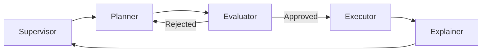

# Functional Specification & Technical Architecture

## 1. System Overview

The **Governed Financial Advisor** is a high-reliability agentic system designed for regulated financial environments. It implements the **MACAW Architecture** (Multi-Agent Conversational AI Workflow), ensuring strict separation of concerns between Planning, Evaluation, and Execution.

## 2. Technical Architecture

### 2.1. Cybernetic Control Plane (LangGraph)
*   **Entry Point**: `src/governed_financial_advisor/server.py` hosts a FastAPI application.
*   **Orchestration**: `src/governed_financial_advisor/graph/graph.py` defines the MACAW sequential flow.
*   **Roles**:
    *   **Planner (System 4):** `Execution Analyst`. Anticipates future states.
    *   **Evaluator (System 3):** `Evaluator Agent`. Simulates and controls risk.
    *   **Executor (System 1):** `Governed Trader`. Executes authorized actions.
    *   **Monitor (System 3):** `Explainer Agent`. Reports faithfully.

### 2.2. Reasoning Plane (Sovereign vLLM)
*   **Agents**: Located in `src/governed_financial_advisor/agents/`.
*   **Evaluator**: A new specialized agent that orchestrates parallel simulation checks (Market, OPA, NeMo).
*   **Explainer**: A dedicated agent for translating technical outputs to user-friendly, faithful text.
*   **Infrastructure**: Powered by **DeepSeek-R1-Distill-Llama-8B** (Node A) and **Llama-3.2-3B** (Node B).

### 2.3. Governance Layer ("The Green Stack")
*   **Evaluator-Driven**: Governance is no longer a sidecar "middleware" but an active **Agentic Step**.
*   **Tools**:
    *   `verify_policy_opa`: Wraps OPA for regulatory checks.
    *   `verify_semantic_nemo`: Wraps NeMo for semantic checks.
    *   `check_market_status`: Mock simulation tool.

## 3. Component Wiring Diagram (MACAW)

## 4. Gap Analysis (Documentation vs. Code)

### 4.1. MACAW Implementation ✅ RESOLVED
*   **Previous Gap**: System used a parallel "Optimistic" flow that mixed Planning and Execution checks.
*   **Current State**: Refactored to strict **Planner -> Evaluator -> Executor** sequence.

### 4.2. Governance Redundancy ✅ RESOLVED
*   **Previous Gap**: Redundant "Worker/Verifier" inside `Governed Trader` and parallel `OptimisticNode`.
*   **Current State**: Removed redundant nodes. Consolidated all verification logic into the **Evaluator Agent**, leveraging parallel tool execution for performance.

### 4.3. Faithfulness
*   **Current State**: Introduced **Explainer Agent** with explicit "Self-Reflection" prompts to ensure response faithfulness to execution logs.
