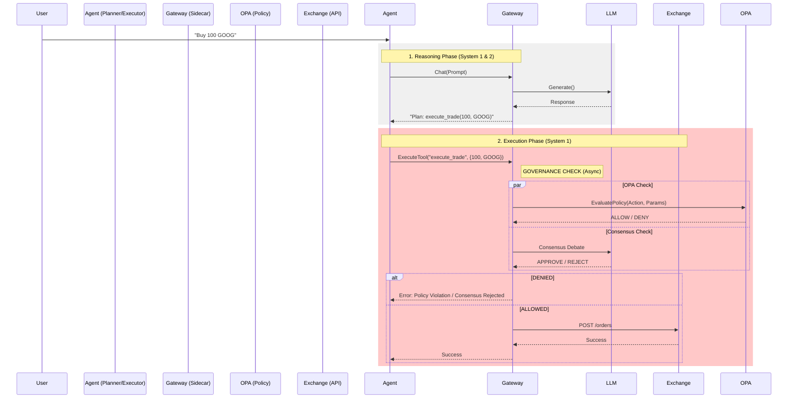

# Architecture: Agentic Gateway & MACAW

This document describes the **Cybernetic Governance Architecture** of the Financial Advisor system, now refactored into the **Agentic Gateway** pattern.

## 1. The Agentic Gateway Pattern

We have transitioned from a "Fat Agent" (In-Process Governance) to a **Hybrid Agentic Gateway** architecture.

### 1.1. The Gateway Service (Sidecar or Microservice)
The **Gateway** (`src/gateway/`) is a dedicated gRPC service that acts as the physical interface between the Agent's "Mind" and the "External World".

*   **Deployment Mode:**
    *   **Sidecar (Standard):** Deployed alongside the Agent in GKE/Cloud Run (Localhost).
    *   **Microservice (Agent Engine):** Deployed as a standalone Cloud Run service when the Agent runs on Vertex AI Agent Engine.

*   **Protocol:** gRPC (Port 50051).
*   **Responsibilities:**
    1.  **LLM Proxy:** Routes all generation requests to the appropriate provider (vLLM vs Vertex). Handles Token Counting, Cost Tracking, and Data Loss Prevention (DLP).
    2.  **Execution Proxy:** The *only* component authorized to execute "Effectful Tools" (e.g., `execute_trade`).
    3.  **Policy Enforcement:** Centralizes OPA, Circuit Breaker, and Safety Filter logic.
    4.  **Consensus Engine:** Orchestrates multi-agent debate (Risk/Compliance) for high-stakes actions using Async I/O to avoid blocking the request loop.

### 1.2. The Stateless Agent (Reasoning Engine)
The **Agent** (`src/governed_financial_advisor/`) is now a "Pure Reasoner".

*   **Platform:** Can run on **Kubernetes** (Standard) or **Vertex AI Agent Engine** (Hybrid).
*   **No API Keys:** It does not hold credentials for the Exchange or Production LLMs.
*   **No Execution Logic:** It cannot execute a trade. It can only *request* the Gateway to do so via `gateway_client.execute_tool()`.
*   **Security Boundary:** Even if the Agent is compromised via Prompt Injection, it cannot bypass the Gateway's OPA checks because the network call to the Exchange happens *inside* the Gateway, not the Agent.

---

## 2. The Execution Flow

---

## 3. Infrastructure Migration

| Component | Old Location (Agent) | New Location (Gateway) |
| :--- | :--- | :--- |
| **LLM Client** | `infrastructure/llm_client.py` (Logic) | `src/gateway/core/llm.py` |
| **OPA Client** | `governance/client.py` | `src/gateway/core/policy.py` |
| **Tool Logic** | `tools/trades.py` (Implementation) | `src/gateway/core/tools.py` |
| **CircuitBreaker** | `governance/client.py` | `src/gateway/core/policy.py` |

The Agent now contains **Stubs** (`infrastructure/gateway_client.py`) that forward calls to the Gateway.

---

## 4. Why gRPC?

We selected gRPC for the Gateway interface to support the "Latency as Currency" model:

1.  **Streaming:** Native bidirectional streaming allows the Gateway to proxy LLM token streams back to the Agent with minimal buffering overhead.
2.  **Strict Contracts:** Protobuf definitions (`src/gateway/protos/gateway.proto`) ensure the Agent and Gateway strictly agree on Tool definitions, preventing "Hallucinated Arguments".
3.  **Performance:** Persistent HTTP/2 connections minimize the overhead of high-frequency "Thought/Action" loops.
