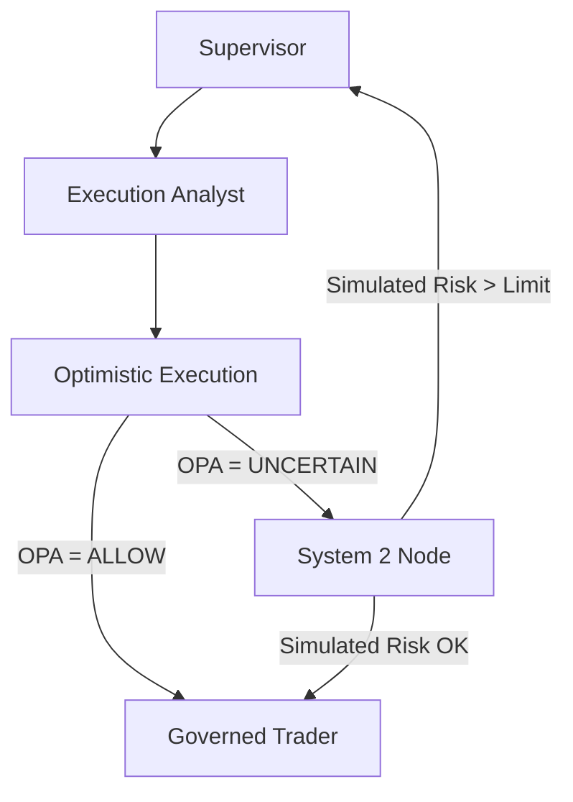

# Causal Engine Architecture

The **Causal Engine** is the "System 2" reasoning capability of the Sovereign Stack. It provides a rational fallback mechanism when rule-based governance (System 1/OPA) is **UNCERTAIN** about the safety of an action.

## 1. Core Concept

Unlike OPA, which applies deterministic rules (e.g., "Limit < $1000"), the Causal Engine uses a probabilistic **Structural Causal Model (SCM)** to simulate the future consequences of an action before it happens.

*   **System 1 (OPA):** Fast, Pattern-Matching, Deterministic. "Is this allowed?"
*   **System 2 (Causal):** Slow, Deliberative, Probabilistic. "What happens if I do this?"

## 2. Components

### 2.1 Runtime Engine (`src/causal/engine.py`)
*   **Role:** Embedded, in-process Python module.
*   **Tech:** `dowhy.gcm` (DoWhy: Graphical Causal Models).
*   **Function:** Loads a serialized SCM (`models/prod_scm_v1.pkl`) and executes `simulate_intervention` to estimate the effect of an action (Intervention) on a safety metric (Outcome).
*   **Decision:** If the simulated risk (e.g., `Churn_Probability`) exceeds `RUNTIME_RISK_LIMIT` (0.50), the action is blocked.

### 2.2 Offline Training (`scripts/train_causal_model.py`)
*   **Role:** Constructs the "Physics" of the domain.
*   **Tech:** `networkx` for DAG definition, `scikit-learn` for non-linear mechanisms.
*   **Output:** Generates the `models/prod_scm_v1.pkl` artifact.
*   **Logic:** Currently simulates the "Insult Effect"—where blocking a high-tenure customer causes a non-linear spike in churn probability.

### 2.3 Policy Induction (`scripts/causal_policy_induction.py`)
*   **Role:** "Safety Discovery" Loop.
*   **Function:** Systematically probes the Causal Model to find the boundary where safe actions become unsafe.
*   **Output:** Generates OPA Rego policies (`policies/generated_causal_rules.rego`).
*   **Example:** "Blocking is unsafe if Tenure > 0.0 years."

## 3. Integration

The Causal Engine is integrated into the LangGraph workflow via the **System 2 Node** (`src/graph/nodes/system_2_nodes.py`).



## 4. Usage

### Training the Model
```bash
python scripts/train_causal_model.py
```

### Generating Policies
```bash
python scripts/causal_policy_induction.py
```

### Runtime
The engine is automatically initialized by the `ProductionSCM` singleton when the Agent starts. It requires the `.pkl` artifact to be present.
