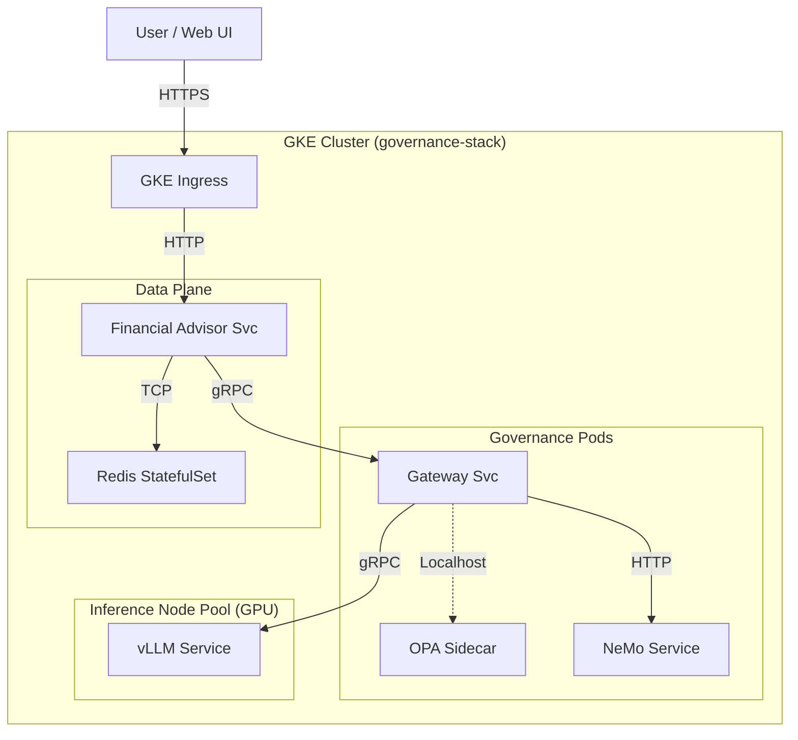

# Deployment Options Analysis: Cloud Run vs. GKE

## Executive Summary

This document analyzes the deployment strategy for the **Governed Financial Advisor** system, focusing on the trade-offs between **Google Cloud Run** (Serverless) and **Google Kubernetes Engine (GKE)**.

**Key Constraints:**
1.  **GPU Requirement:** The **Gateway Subsystem** (specifically the `vLLM` service) requires persistent GPU resources for local LLM inference.
2.  **State Requirement:** The system relies on **Redis** for state management (LangGraph checkpoints, caching).
3.  **Services Scope:**
    *   **Gateway Service** (gRPC, Governance Logic)
    *   **vLLM Service** (GPU Inference Backend)
    *   **Financial Advisor** (Main Application, HTTP)
    *   **OPA** (Policy Engine, lightweight)
    *   **NeMo Guardrails** (Governance Sidecar)

**Recommendation:** **Deploy to GKE (Standard)**.
While Cloud Run offers simplicity for stateless services, the hard requirement for **persistent GPU inference (vLLM)** and **stateful storage (Redis)** makes GKE the more robust and cost-effective choice for this specific architecture. Cloud Run's GPU support is currently in Preview and optimized for sporadic inference, not the high-throughput, low-latency "always-on" serving required by vLLM.

---

## 1. Workload Analysis

| Service | Type | Resource Needs | Statefulness | Networking |
| :--- | :--- | :--- | :--- | :--- |
| **vLLM Service** | Inference Server | **GPU (High VRAM)**, High RAM | Stateless (but heavy model weights) | Internal gRPC/HTTP |
| **Gateway Service** | Middleware | CPU, Low Memory | Stateless | Exposes gRPC, Calls vLLM |
| **Financial Advisor** | App Server | CPU, Med Memory | Stateless | Exposes HTTP, Calls Gateway |
| **OPA** | Policy Engine | CPU, Low Memory | Stateless (Policies cached) | Internal Sidecar |
| **NeMo** | Guardrails | CPU, Med Memory | Stateless | Internal HTTP |
| **Redis** | Database | Memory | **Stateful** (Persistence) | Internal TCP |

---

## 2. Platform Comparison

### Google Cloud Run (Serverless)
*   **Pros:**
    *   **Simplicity:** No cluster management. "Scale to Zero" reduces costs for idle dev environments.
    *   **Integration:** Native IAM integration, easy domain mapping.
    *   **Ops:** No patching of nodes or master control plane.
*   **Cons:**
    *   **GPU Limitations:** Cloud Run GPU support is in **Preview**. It supports NVIDIA L4 GPUs but has significant cold start times (loading large models takes seconds to minutes), making it unsuitable for real-time interactive "Chat" agents unless `min_instances > 0` (which negates cost savings).
    *   **State:** Does not support persistent volumes for databases like Redis. You must use **Memorystore** (Managed Redis) which is expensive and lives outside the service, or risk data loss with in-memory instances.
    *   **Networking:** Service-to-service communication requires OIDC authentication handling, adding complexity to `gRPC` calls between microservices.

### Google Kubernetes Engine (GKE)
*   **Pros:**
    *   **GPU Power:** Native support for all GPU types (L4, T4, A100). Persistent nodes mean **no cold starts** for model loading.
    *   **State Management:** Supports StatefulSets and PersistentVolumes (PVC) for running Redis efficiently within the cluster (or connecting to Memorystore).
    *   **Networking:** Internal DNS (`svc.cluster.local`) makes microservice communication trivial. No auth overhead for internal calls.
    *   **Resource Efficiency:** Bin-packing multiple lightweight services (OPA, NeMo, Gateway) onto the same nodes as the Advisor.
*   **Cons:**
    *   **Complexity:** Requires managing node pools, upgrading clusters (mostly automated now), and writing Kubernetes manifests/Helm charts.
    *   **Cost:** Control plane fee (if not using Autopilot/Zonal) and idle node costs if not carefully autoscaled.

---

## 3. Deep Dive: Critical Blockers

### The "vLLM" GPU Problem
The **Gateway** architecture relies on `vLLM` acting as a high-performance inference server.
*   **On Cloud Run:** Every time a new instance spins up (scale-out), it must download/load the model weights (10GB+ for Llama-3-8B) into VRAM. This causes a **Cold Start of 30s - 2min**. This is unacceptable for a "Financial Advisor" chat interface. Keeping an instance warm (`min_instances=1`) runs the GPU 24/7, costing the same as GKE but with less control.
*   **On GKE:** The vLLM Pod runs on a node with a GPU attached. The model stays loaded in VRAM. Requests are served instantly (<20ms TTFT).

### The "Redis" State Problem
The application uses **LangGraph** with Redis checkpoints.
*   **On Cloud Run:** You cannot run Redis *inside* Cloud Run reliably. You must provision **Cloud Memorystore for Redis** (managed service). This is production-grade but adds a minimum fixed cost (~$35/mo for basic tier) and network peering complexity (Serverless VPC Access Connector).
*   **On GKE:** You can deploy a Redis `StatefulSet` or use a Helm Chart (e.g., Bitnami Redis) directly in the cluster. For non-critical production or dev/test, this is practically free (uses spare RAM on existing nodes). For production, you can still use Memorystore.

---

## 4. Architecture Recommendation: "Unified GKE Cluster"

We recommend deploying the entire stack to a **GKE Standard Cluster**.

### Architecture Diagram

### Proposed Configuration
1.  **Node Pool A (General Purpose):**
    *   **Machine Type:** `e2-standard-4` (4 vCPU, 16GB RAM).
    *   **Workloads:** Financial Advisor, Gateway, OPA, NeMo, Redis.
    *   **Autoscaling:** 1-5 nodes.
2.  **Node Pool B (GPU Inference):**
    *   **Machine Type:** `g2-standard-4` (4 vCPU, 16GB RAM) + **1x NVIDIA L4 GPU**.
    *   **Workloads:** vLLM Service.
    *   **Taints/Tolerations:** Ensure only vLLM runs here to maximize GPU availability.

### Why not GKE Autopilot?
*   **GKE Autopilot** is excellent for CPU workloads but has stricter limitations on GPU resource requests and system capabilities (e.g., shared memory `/dev/shm` size). vLLM often requires large shared memory, which can be tricky to configure on Autopilot.
*   **Standard GKE** gives you full control over the `tmpfs` mounts required for PyTorch/NCCL (used by vLLM).

---

## 5. Cost Estimation (Monthly, Approximate)

| Component | Specification | Est. Cost (GKE) | Est. Cost (Cloud Run + Memorystore) |
| :--- | :--- | :--- | :--- |
| **Compute (App)** | 2x e2-standard-2 | ~$100 | ~$50 (Scale to zero savings) |
| **Compute (GPU)** | 1x NVIDIA L4 | ~$250 | ~$250 (Must run 24/7 to avoid cold starts) |
| **Database** | Redis (In-Cluster) | $0 (Shared resources) | $35 (Memorystore Basic) |
| **Control Plane** | GKE Management | $72 (Free zonal available) | $0 |
| **Networking** | Load Balancing | ~$18 | $0 (Included) |
| **TOTAL** | | **~$440** | **~$335 - $400** |

**Verdict:** The cost difference is negligible when factoring in the requirement to keep the GPU warm. GKE offers significantly better performance, debugging capabilities, and local state management for this specific complex stack.

## 6. Migration Steps (from current Terraform)

1.  **Refine `gke.tf`**: Ensure `google_container_node_pool` is split into `default-pool` (CPU) and `gpu-pool` (GPU) with correct taints.
2.  **Redis on K8s**: Add a Kubernetes manifest for Redis (Deployment or StatefulSet) instead of relying on external services or Cloud Run sidecars.
3.  **vLLM Manifest**: Ensure `vllm-deployment.yaml` tolerates the GPU node taints.
4.  **Gateway Service**: Deploy as a standard Kubernetes Deployment + Service.
