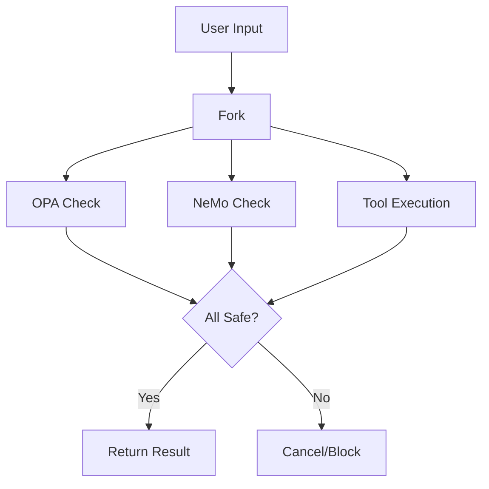

# Sovereign Stack Architecture (Phase 1 & 2)

This document describes the "Sovereign Stack" architecture for the Governed Financial Advisor. This architecture prioritizes **Cloud Independence** and **Portability**, enabling the system to run on any infrastructure (local Docker, AWS, Azure, On-Prem) without strictly relying on proprietary cloud managed services (like Vertex AI Agent Engine or Google Cloud Workflows) for orchestration and governance.

## 1. Core Principles

*   **Cloud Agnostic Orchestration:** Uses `LangGraph` and `Google ADK` (Python SDK) running in standard containers, rather than proprietary cloud workflow engines.
*   **Sidecar Governance:** Governance policies (OPA) and Semantic Guardrails (NeMo) run as "Sidecar" containers or services, communicating via standard protocols (HTTP/UDS).
*   **Standardized State:** Uses `Redis` (with AOF persistence) for state management, which is an open-source standard available on all cloud providers.
*   **Pure Python Tooling:** Tools are implemented as standard Python functions, wrapped by the agent framework, ensuring they can be ported or tested in isolation.

## 2. Architecture Components

### 2.1 Orchestrator (LangGraph + ADK)
*   **Role:** Manages the agent workflow, routing, and state transitions.
*   **Implementation:** `src/graph/`
*   **Concurrency:** Uses Python's `asyncio` for **Optimistic Parallel Execution**.
    *   *Rail A:* Governance Policy Check (OPA)
    *   *Rail B:* Semantic Guardrails Check (NeMo)
    *   *Rail C:* Tool Execution / LLM Generation
*   **Dependency Injection:** Agents are created via factory functions (`create_..._agent`) to allow for modularity and easy testing.

### 2.2 Policy Decision Point (OPA Sidecar)
*   **Role:** Enforces deterministic safety policies (e.g., "Max Drawdown < 5%").
*   **Implementation:** `openpolicyagent/opa` container.
*   **Communication:**
    *   **Phase 1 (Local/Docker):** Uses **Unix Domain Sockets (UDS)** for ultra-low latency (~50µs) communication.
    *   **Protocol:** JSON over HTTP/UDS.
*   **Resilience:** The client (`src/governance/client.py`) implements a **Circuit Breaker** (Fail Fast) to prevent cascading failures if OPA is down.

### 2.3 Semantic Guardrails (NeMo Sidecar)
*   **Role:** Enforces semantic safety (e.g., "Check if trade amount comes from user input").
*   **Implementation:** Custom FastAPI service wrapping `nemoguardrails` (`src/governance/nemo_server.py`).
*   **Configuration:** Colang flows in `src/governance/rails/`.
*   **Pattern:** Acts as an "Output Rail" for the Verifier Agent.

### 2.4 State Store (Redis)
*   **Role:** Persists conversation history, agent state (`ControlLoop` metadata), and safety barrier (CBF) state.
*   **Configuration:** AOF (Append Only File) enabled for durability.

## 3. Optimistic Parallel Execution (The "Fast Path")

To mitigate the latency overhead of having multiple "sidecar" checks, we implement Optimistic Parallel Execution.

**Traditional (Sequential):**
`User Input` -> `NeMo Check` (Wait) -> `OPA Check` (Wait) -> `LLM/Tool` (Wait) -> `Response`

**Sovereign Stack (Parallel):**


*   **Logic:** `src/graph/nodes/optimistic_nodes.py`
*   **Benefit:** The total latency is determined by the *slowest* component (usually the LLM/Tool), effectively "hiding" the latency of the governance checks.
*   **Kill Switch:** If Rail A or Rail B fails (returns DENY), Rail C is immediately cancelled to prevent unsafe side effects.

## 4. Running the Stack (Docker Compose)

The entire stack can be brought up locally for development or verification.

```bash
docker-compose up --build
```

**Services:**
*   `nemo`: Guardrails API (Port 8000)
*   `opa`: Policy Engine (Port 8181)
*   `redis`: State Store (Port 6379)

The application (Orchestrator) connects to these services via environment variables defined in `.env` or `config/settings.py`.

## 5. Migration Path to Phase 3 (Platform Native)

While this stack is sovereign, it is designed to be "Platform Ready":
*   **OPA:** Can be deployed to Cloud Run (Server-Side OPA) without code changes (just URL update).
*   **NeMo:** Can be deployed as a standalone Microservice.
*   **Redis:** Can be swapped for Cloud Memorystore or Firestore (for ADK state).
*   **Orchestrator:** The `Google ADK` agents are compatible with Vertex AI Agent Engine.

This architecture ensures you own your control plane today, while keeping the door open for managed services tomorrow.
