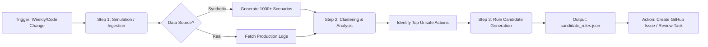

# Proposal 002: Automated Rule Discovery Pipeline (Vertex AI)

## 1. Executive Summary
This proposal outlines an automated MLOps pipeline using **Google Cloud Vertex AI Pipelines** to accelerate the discovery of new safety rules (UCAs) for the Green Agent. Instead of manually running simulation scripts, this pipeline runs on a schedule (e.g., weekly) or trigger, processing synthetic or real agent logs to propose new `SafetyRule` candidates for human approval.

## 2. Architecture

The pipeline follows a "Map-Reduce" pattern for log analysis, culminating in a "Human-in-the-Loop" review step.

## 3. Vertex AI Pipeline Components

The pipeline utilizes the Kubeflow Pipelines (KFP) SDK.

### Component 1: `generate_risk_logs`
*   **Role:** Data Producer.
*   **Implementation:** Wraps `scripts/simulate_risk_scenarios.py`.
*   **Output:** `Dataset` (JSONL files).
*   **Scale:** Can run parallel instances to generate 10k+ logs.

### Component 2: `analyze_clusters`
*   **Role:** Analysis Engine.
*   **Implementation:** Wraps `scripts/analyze_risk_logs.py` but enhanced with LLM-based semantic clustering (using Vertex AI Gemini API).
*   **Logic:**
    1.  Parse rejections.
    2.  Embed "Reasoning Summary" into vector space.
    3.  Cluster vectors (HDBSCAN or K-Means).
    4.  Extract common keywords for each dense cluster.

### Component 3: `propose_rules`
*   **Role:** Candidate Generator.
*   **Input:** Clusters.
*   **Output:** `Artifact` (JSON Rule Proposals).
*   **Logic:** Formats clusters into `SafetyViolation` definitions (ID, Description, Trigger Keywords).

## 4. Human-in-the-Loop (Approval)

The pipeline does **not** automatically commit code. It creates a "Rule Candidate" artifact.

**Approval Mechanism:**
1.  **Vertex AI Evaluation UI:** The pipeline outputs an HTML report showing the new clusters vs. existing rules.
2.  **GitOps Integration:** A Cloud Build trigger observes the pipeline output. If new high-confidence candidates are found, it opens a **GitHub Issue** titled "New Safety Rule Candidates Found [Date]".
3.  **Human Action:** A Governance Engineer reviews the issue, selects valid rules, and implements them in `src/green_agent/safety_rules.py`.

## 5. Implementation Roadmap

1.  **Prerequisite:** Enable Vertex AI API & Pipelines in GCP.
2.  **Phase 1 (Code Definition):** Create `src/pipelines/rule_discovery.py` defining the DAG.
3.  **Phase 2 (Containerization):** Dockerize the `scripts/` directory to serve as the base image for pipeline steps.
4.  **Phase 3 (Deployment):** Deploy to Vertex AI Metadata Store.

## 6. Benefit
Reduces the feedback loop from "New Market Risk Identified" to "Green Agent Protected" from weeks to hours.
