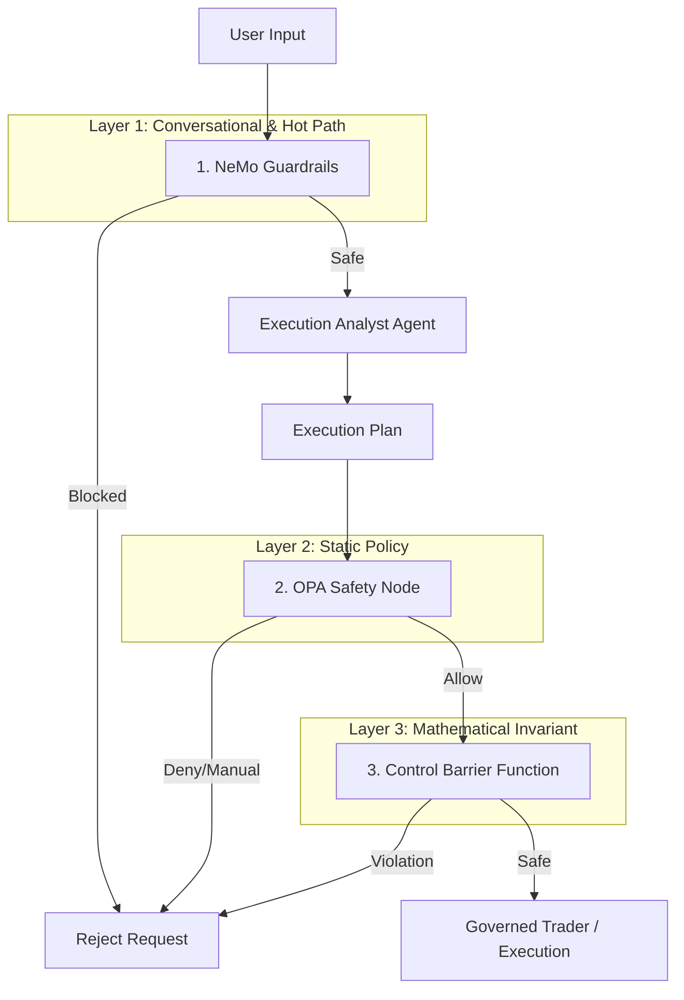

# Governance & Safety Logic

This directory implements the multi-layered safety architecture of the Green Stack. It enforces safety through three distinct mechanisms, ranging from conversational guardrails to mathematical state invariants.

## Safety Architecture Overview

The system employs a "Defense in Depth" strategy, applying checks at different stages of the agent's lifecycle.



---

## 1. NeMo Guardrails (Conversational & Hot Path)
**Scope:** Prompt/Response Content & deterministic "Hot Path" checks.
**Implementation:** `config/rails/config.yml` (Flows) & `src/governance/nemo_actions.py` (Actions).

NeMo Guardrails serves as the first line of defense. It operates in two modes:

1.  **Conversational Rails:** Checks the user's prompt (Input Rail) and the agent's response (Output Rail) for jailbreaks, toxicity, and topic relevance.
2.  **Hot Path Actions:** deterministic Python functions that intercept tool calls in milliseconds to block unsafe actions based on immediate context.

**Key Actions:**
*   `check_approval_token`: Validates cryptographic signatures (Mock AP2) for authorization.
*   `check_data_latency`: Ensures decisions are not based on stale data (>100ms old).
*   `check_atomic_execution`: Verifies multi-leg trade integrity using `audit_trail`.
*   `check_drawdown_limit` & `check_slippage_risk`: Dynamic checks generated by the **Transpiler**.

---

## 2. OPA (Open Policy Agent)
**Scope:** Static Policy Enforcement on Execution Plans.
**Implementation:** `src/graph/nodes/safety_node.py` (Interceptor) & `src/governance/client.py` (OPA Client).

The **Safety Check Node** intercepts the structured `ExecutionPlan` produced by the Execution Analyst *before* it reaches the execution layer. It queries the OPA Sidecar to validate the proposed action against static organizational policies.

**Workflow:**
1.  **Intercept:** The `safety_check_node` extracts the plan (action, amount, symbol).
2.  **Query:** Sends a payload to OPA:
    ```json
    {
      "action": "buy",
      "amount": 1000,
      "symbol": "AAPL",
      "user_id": "user_123",
      "risk_profile": "conservative"
    }
    ```
3.  **Enforce:**
    *   **ALLOW:** Plan proceeds to the next layer.
    *   **MANUAL_REVIEW:** Escalates to human oversight.
    *   **DENY:** Blocks the execution and informs the planner.

---

## 3. Control Barrier Functions (CBFs)
**Scope:** Mathematical Safety & State Invariants.
**Implementation:** `src/governance/safety.py`.

CBFs provide the final, hard-stop safety layer by enforcing mathematical invariants based on the system's *current state*. Unlike OPA (which checks *intent* against policy), CBFs check *feasibility* against physical or financial constraints.

**The Invariant:**
We enforce that the system must always remain in a "Safe Set" defined by the barrier function $h(x)$.
*   **Invariant:** `cash_balance >= min_balance`
*   **Safety Condition:** $h(\text{next\_state}) \ge (1 - \gamma) \cdot h(\text{current\_state})$

**Mechanism:**
1.  **State Persistence:** Uses **Redis** (`safety:current_cash`) to maintain state across stateless Cloud Run instances.
2.  **Verification:**
    *   Fetches current cash from Redis.
    *   Calculates the impact of the proposed trade.
    *   Blocks execution if the resulting state violates the barrier condition.
3.  **Update:** Updates the Redis state only after successful verification and execution.

---

## 4. The Transpiler
**Role:** Automated Rule Derivation.
**Implementation:** `src/governance/transpiler.py`.

The Transpiler bridges the offline "Risk Analyst" and the runtime NeMo Guardrails. It converts `ProposedUCA` (Unsafe Control Actions) identified by the Risk Analyst into executable NeMo Python actions.

*   **Input:** Risk Analysis (e.g., "Slippage > 5% is unsafe").
*   **Process:** Parses logic and generates Python code.
*   **Output:** Updates `generated_actions.py`, which is dynamically imported by `nemo_actions.py` to hot-swap safety rules without redeployment.
